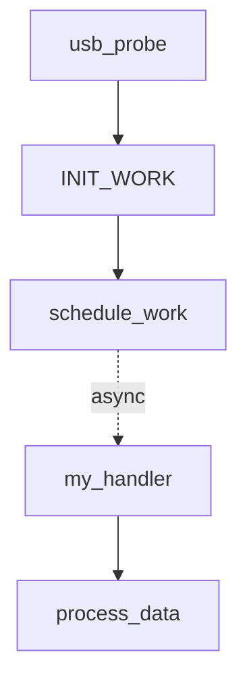

# FlowSight 功能说明

本文档详细介绍 FlowSight 的所有功能特性。

## 目录

- [执行流可视化](#执行流可视化)
- [异步机制识别](#异步机制识别)
- [知识库系统](#知识库系统)
- [代码编辑器](#代码编辑器)
- [导出功能](#导出功能)
- [主题系统](#主题系统)

---

## 执行流可视化

FlowSight 的核心功能是将代码执行流程可视化为交互式图表。

### 功能特点

| 特性 | 描述 |
|------|------|
| **调用链追踪** | 从入口函数到目标函数的完整调用路径 |
| **异步边界识别** | 自动识别 WorkQueue、Timer、IRQ 等异步边界 |
| **上下文标注** | 每个节点显示执行上下文（进程/软中断/硬中断） |
| **交互式导航** | 点击节点跳转到代码，双击展开子调用 |

### 视图模式

FlowSight 提供三种视图模式：

#### 1. 图形视图（默认）

```
┌─────────────┐      ┌─────────────┐      ┌─────────────┐
│  usb_probe  │ ───→ │  INIT_WORK  │ ───→ │  handler    │
│  (process)  │      │  (绑定)      │      │  (process)  │
└─────────────┘      └─────────────┘      └─────────────┘
                            │
                            ▼
                     ┌─────────────┐
                     │schedule_work│
                     │  (触发)      │
                     └─────────────┘
```

#### 2. 文本视图（ftrace 风格）

```
 0) usb_probe() {
 0)   INIT_WORK(&dev->work, my_handler);
 0)   /* WorkQueue: 绑定 handler */
 0)   schedule_work(&dev->work);
 0) }
 ---async boundary (WorkQueue)---
 0) my_handler() {
 0)   /* 进程上下文，可睡眠 */
 0)   process_data();
 0) }
```

#### 3. 树形视图

```
usb_probe [进程上下文]
├── INIT_WORK [绑定: my_handler]
├── schedule_work [触发]
│   └── [异步边界: WorkQueue]
│       └── my_handler [进程上下文]
│           └── process_data
└── return 0
```

### 执行上下文颜色

| 颜色 | RGB | 上下文 | 可睡眠 | 典型场景 |
|------|-----|--------|--------|----------|
| 🟢 绿色 | `#22c55e` | 进程上下文 | ✅ | 系统调用、probe 函数 |
| 🔵 蓝色 | `#3b82f6` | 工作队列 | ✅ | WorkQueue handler |
| 🟠 橙色 | `#f97316` | 软中断 | ❌ | SoftIRQ、Tasklet |
| 🔴 红色 | `#ef4444` | 硬中断 | ❌ | IRQ handler |
| 🟣 紫色 | `#a855f7` | 定时器 | ❌ | Timer callback |
| ⚪ 灰色 | `#6b7280` | 未知 | ？ | 无法确定的上下文 |

---

## 异步机制识别

FlowSight 自动识别 Linux 内核中的所有主要异步机制。

### 支持的异步机制

#### WorkQueue（工作队列）

| 模式 | 绑定 API | 触发 API | 执行上下文 |
|------|----------|----------|-----------|
| work_struct | `INIT_WORK()` | `schedule_work()` | 进程 |
| delayed_work | `INIT_DELAYED_WORK()` | `schedule_delayed_work()` | 进程 |
| rcu_work | `INIT_RCU_WORK()` | `queue_rcu_work()` | 进程 |

**示例**：
```c
INIT_WORK(&dev->work, my_handler);    // 绑定
schedule_work(&dev->work);             // 触发
// → FlowSight 自动关联 my_handler 到 schedule_work
```

#### Timer（定时器）

| 模式 | 绑定 API | 触发 API | 执行上下文 |
|------|----------|----------|-----------|
| timer_list | `timer_setup()` | `mod_timer()` | 软中断 |
| hrtimer | `hrtimer_init()` | `hrtimer_start()` | 硬中断/软中断 |

**示例**：
```c
timer_setup(&dev->timer, my_timer_callback, 0);  // 绑定
mod_timer(&dev->timer, jiffies + HZ);            // 触发
// → FlowSight 追踪到 my_timer_callback
```

#### IRQ（中断）

| 模式 | 注册 API | 执行上下文 |
|------|----------|-----------|
| 硬中断 | `request_irq()` | 硬中断 |
| 线程化中断 | `request_threaded_irq()` | 硬中断 + 进程 |
| 共享中断 | `IRQF_SHARED` | 硬中断 |

**示例**：
```c
request_threaded_irq(irq, hard_handler, thread_handler, ...);
// → FlowSight 识别两个 handler 和它们的执行上下文
```

#### Tasklet（小任务）

| 模式 | 绑定 API | 触发 API | 执行上下文 |
|------|----------|----------|-----------|
| tasklet_struct | `tasklet_init()` | `tasklet_schedule()` | 软中断 |
| tasklet_hi | `tasklet_init()` | `tasklet_hi_schedule()` | 软中断（高优先级）|

#### Kthread（内核线程）

| 模式 | 创建 API | 启动 API | 执行上下文 |
|------|----------|----------|-----------|
| kthread | `kthread_create()` | `wake_up_process()` | 进程 |
| kthread_worker | `kthread_create_worker()` | `kthread_queue_work()` | 进程 |

---

## 知识库系统

FlowSight 内置了完整的 Linux 内核知识库，用于理解 API 语义。

### 知识库统计

| 指标 | 数量 |
|------|------|
| YAML 文件数 | 116 |
| 覆盖子系统 | 12 |
| API 模式数 | 6,200+ |

### 覆盖的子系统

| 子系统 | 目录 | 覆盖度 | 关键 API |
|--------|------|--------|----------|
| **内存管理** | `core/` | 95% | kmalloc, vmalloc, DMA, SLUB |
| **调度器** | `core/` | 95% | schedule, wait_event, completion |
| **中断** | `core/` | 95% | request_irq, softirq, tasklet |
| **工作队列** | `core/` | 95% | INIT_WORK, schedule_work |
| **定时器** | `core/` | 95% | timer_setup, hrtimer |
| **文件系统** | `fs/` | 90% | VFS, procfs, sysfs, debugfs |
| **驱动框架** | `drivers/` | 90% | platform, USB, I2C, SPI, PCI |
| **网络** | `net/` | 85% | netdev, socket, TCP/UDP |
| **同步原语** | `sync/` | 95% | spinlock, mutex, RCU, semaphore |
| **架构相关** | `arch/` | 80% | ARM32, ARM64, x86, RISC-V |
| **块设备** | `block/` | 85% | bio, blk-mq, elevator |
| **库函数** | `lib/` | 90% | list, rbtree, xarray, idr |

### 知识库信息面板

选中函数时，右侧面板显示：

```
┌─────────────────────────────────────┐
│ 📚 知识库信息                        │
├─────────────────────────────────────┤
│ 函数: schedule_work                 │
│ 头文件: linux/workqueue.h           │
│ 内核版本: 2.6+                      │
├─────────────────────────────────────┤
│ 📍 执行上下文                        │
│ • 调用上下文: 任意（进程/中断）      │
│ • Handler 上下文: 进程              │
│ • 可睡眠: Handler 可以睡眠          │
├─────────────────────────────────────┤
│ 📖 说明                              │
│ 将工作项加入 system_wq 队列，        │
│ 由 worker 线程在进程上下文中执行。   │
├─────────────────────────────────────┤
│ ⚠️ 注意事项                          │
│ • 同一 work 不能同时在多个队列中     │
│ • 返回 false 表示已在队列中          │
│ • 使用 cancel_work_sync 同步取消    │
└─────────────────────────────────────┘
```

---

## 代码编辑器

FlowSight 集成了 Monaco Editor，提供类似 VS Code 的编辑体验。

### 功能特性

| 功能 | 描述 |
|------|------|
| **语法高亮** | C/C++ 语法着色 |
| **智能感知** | 函数补全、参数提示 |
| **跳转定义** | F12 跳转到定义 |
| **查找引用** | Shift+F12 查找所有引用 |
| **多标签页** | 同时打开多个文件 |
| **小地图** | 右侧代码缩略图 |
| **折叠** | 代码块折叠/展开 |

### 集成功能

- **执行流标记**：异步绑定/触发点高亮
- **上下文提示**：悬停显示知识库信息
- **快速导航**：点击执行流节点跳转

---

## 导出功能

FlowSight 支持多种格式导出分析结果。

### 导出格式

| 格式 | 扩展名 | 用途 |
|------|--------|------|
| **Mermaid** | `.md` | 嵌入 Markdown 文档 |
| **表格** | `.md` | 结构化数据 |
| **纯文本** | `.txt` | ftrace 风格，便于比较 |
| **AI 格式化** | `.md` | 适合 LLM 分析的格式 |

### 导出示例

#### Mermaid 格式



#### 表格格式

| 函数 | 上下文 | 可睡眠 | 调用者 |
|------|--------|--------|--------|
| usb_probe | 进程 | ✅ | usb_device_match |
| my_handler | 进程 | ✅ | workqueue |
| process_data | 进程 | ✅ | my_handler |

---

## 主题系统

FlowSight 提供 6 种低饱和度主题。

### 可用主题

| 主题 | 风格 | 适用场景 |
|------|------|----------|
| **Dark** | 深色 | 夜间/低光环境 |
| **Light** | 浅色 | 日间/高光环境 |
| **Slate** | 灰蓝 | 专业/护眼 |
| **Forest** | 绿色调 | 自然/放松 |
| **Sunset** | 暖色调 | 温馨/舒适 |
| **Lavender** | 紫色调 | 优雅/创意 |

### 切换主题

1. 打开命令面板 (`Cmd/Ctrl+K`)
2. 搜索 "主题" 或 "theme"
3. 选择喜欢的主题

---

## 高级功能

### LLVM IR 查看

查看函数的 LLVM IR 中间表示：

1. 选中函数
2. 命令面板搜索 "LLVM IR"
3. 查看右侧 IR 面板

> ⚠️ 需要安装 clang，且项目有 `compile_commands.json`

### 函数指针解析

FlowSight 自动解析以下函数指针模式：

| 模式 | 示例 |
|------|------|
| **ops 表** | `static struct file_operations fops = { .read = my_read }` |
| **直接赋值** | `dev->ops->read = my_read` |
| **类型匹配** | 基于函数签名推断 |

### 符号搜索

- `Cmd/Ctrl+Shift+P` - 全局符号搜索
- 支持模糊匹配
- 支持过滤器：`@function`, `@struct`, `@macro`

---

## 下一步

- [快速开始](./quick-start.md) - 5 分钟上手
- [异步机制详解](./async-analysis.md) - 深入理解异步模式
- [API 参考](../api/tauri-commands.md) - 开发者 API

---

**更新时间**: 2026-02-04  
**FlowSight 版本**: 0.2.0
